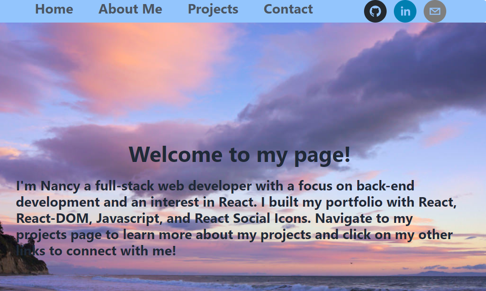
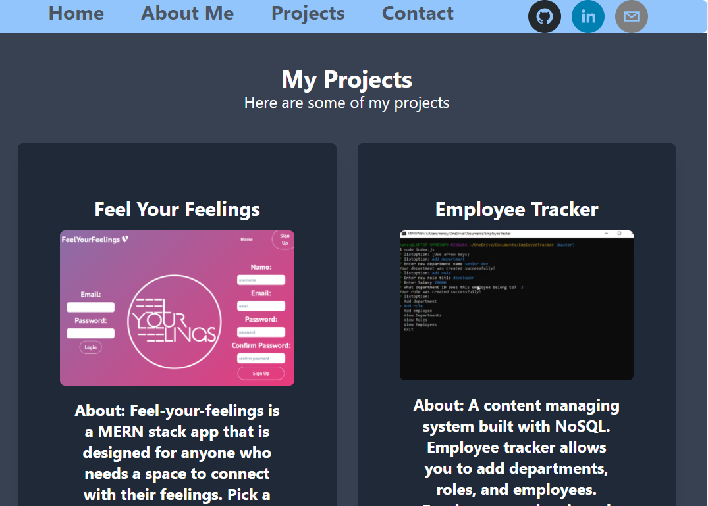

# React Portfolio 🖥️👩‍💻
 

## Description
For this assignment we will be developing our portfolio and creating a react porfolio. In creating a react portfolio I will be using the latest technologies and practice everything I have learned so far.

## User Story
As a user I want to be able to click on my portfolio page and navigate it easily. If I click on a link I will be taken to the corresponding link. Once the page opens I will be presented with projects that I have developed.

## Acceptance Criteria
Given when I open the portfolio and am presented with at least six projects that I have developed
Given when the projects have the title included, links to repo, and a screenshot of the deployed application
Given when I click on a link and I am taken to the corresponding link

## Tools and Technologies
- React
- CSS
- Express
- Tailwind CSS
- React-DOM

## Usage 
 
> **To view my application**: visit deployed [Link]()

## Mock Up

